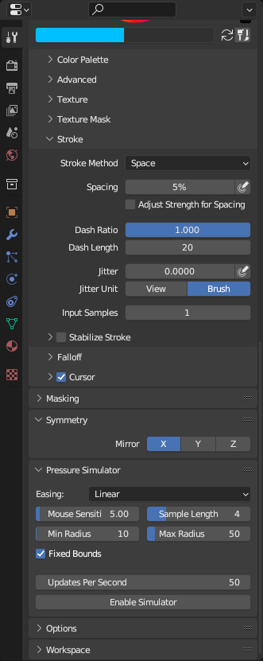

# Blender Pen Pressure Simulator
BPPS is an addon for Blender that simulates pen pressure while texture painting by increasing the brush's stroke size based on mouse pointer speed.

## Installation
Download [BPPSim.py](https://github.com/AngelDTF/BPPS/blob/main/BBPsim.py). Open the Blender preferences (Edit > Preferences...), and go to the "Add-ons" page in the sidebar. On the top right, press the install button, and open the Python script you just downloaded. Lastly, make sure the checkbox is ticked next to the addon name. 

## Usage
Under the tool properties tab, you'll see a new "Pressure Simulator" panel.

There's a few settings to play with here, so I'll explain what they all do.

* **Easing**
  - Can help with smoothing the brush scale. List of possible values:
    - Linear (no smoothing)
	- Cubic In
	- Cubic Out
	- Circ In
	- Circ Out
	- Quart In
	- Quart Out
  - See [this cheat sheet](https://easings.net/) for more info on easing functions.
* **Mouse Sensitivity**
  - This slider controls how sensitive the script is to your pointer speed. You may have to adjust this a bit to match your mouse's DPI.
* **Sample Length**
  - Sets how many pointer speed samples to save for averaging. Higher values can smoothen the brush scaling, but can also add a slight delay when scaling between two contrasting values. It's recommended to raise the updates per second if you use more than 4 samples.
* **Min Radius**
  - Sets the minimum radius of the brush stroke. Slower pointer speeds will result in the brush radius being scaled closer to this value.
* **Max Radius**
  - Sets the maximum radius of the brush stroke. Faster pointer speeds will result in the brush radius being scaled closer to this value.
* **Fixed Bounds**
  - If unchecked, the brush size can exceed the set maximum radius if you pointer speed or sensitivity is high enough. Leave checked if unsure.
* **Updates Per Second**
  - This controls how many times the pointer speed is checked per second. We do not recommended using less than 50 updates per second, as this can cause jittery brush scaling. This setting cannot be changed while the simulator is running.

When you're ready, you can enable the tool with the "Enable Simulator" button. You can mess with all of the settings except the update rate while the tool is on, so make sure everything is tuned nicely before painting.

Once finished, you can simply disable the tool with the "Disable Simulator" button, and everything will return to normal functionality.

